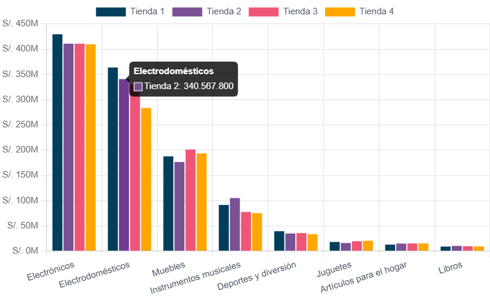
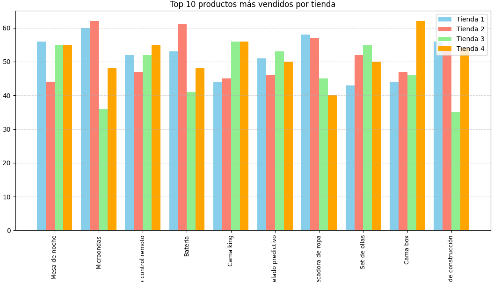
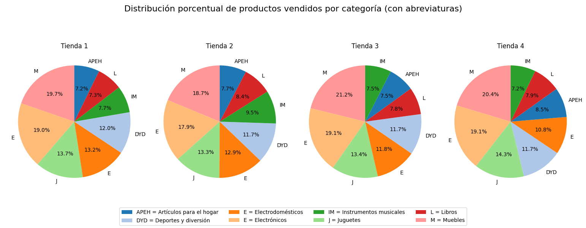

# AluraStoreLatam: Análisis de Rendimiento de Ventas 📊

## 📝 Descripción del Proyecto

Este proyecto de análisis de datos tiene como objetivo principal evaluar el rendimiento de ventas de cuatro tiendas de la cadena comercial **AluraStoreLatam**. A través de un análisis exhaustivo en Python, utilizando Jupyter Notebook, se procesan y visualizan datos para identificar la tienda con el desempeño más bajo y recomendar su posible venta. El análisis se centra en métricas clave como la facturación total, las ventas por categoría de producto, la calificación promedio de los clientes, los productos más y menos vendidos, y los costos de envío.

El proyecto está estructurado para ofrecer una visión clara y concisa de las operaciones de cada tienda, culminando en un informe final con conclusiones y una recomendación estratégica.

## 🎯 Objetivo Principal

Recomendar cuál de las cuatro tiendas de **AluraStoreLatam** debería ser vendida, basándose en un análisis detallado de su rendimiento de ventas y rentabilidad.

## 📁 Estructura del Repositorio

La estructura del repositorio está organizada de la siguiente manera para facilitar la navegación y comprensión del proyecto:

.
├── Challenge1-data-science/
│   ├── .vscode/
│   ├── reports/
│   │   ├── figures/
│   │   │   ├── Distribucion_porcentual_productos_vendidos_por_categoria.png
│   │   │   ├── Ingresos_por_categoria_de_producto.png
│   │   │   ├── Top_10_productos_mas_vendidos_por_tienda.png
│   │   ├── resumen_analisis.md
│   │   └── resumen_analisis.pdf
│   ├── .gitignore
│   ├── AluraStoreLatam.ipynb
│   ├── AluraStoreLatam.py
│   ├── README.md
│   ├── tienda_1.csv
│   ├── tienda_2.csv
│   ├── tienda_3.csv
│   └── tienda_4.csv
└── venv/


- `AluraStoreLatam.ipynb`: El cuaderno de Jupyter que contiene todo el análisis de datos.
- `tienda_*.csv`: Archivos de datos en formato CSV para cada una de las cuatro tiendas.
- `reports/figures/`: Directorio donde se guardan las visualizaciones generadas.
- `reports/`: Contiene el informe final del análisis en formato Markdown y PDF.

## 🚀 Análisis Realizado

El análisis se divide en las siguientes secciones, detalladas en el cuaderno de Jupyter (`AluraStoreLatam.ipynb`):

1.  **Análisis de Facturación**: Comparación de los ingresos totales generados por cada tienda.
2.  **Ventas por Categoría**: Identificación de las categorías de productos más vendidas en cada tienda.
3.  **Calificación Promedio de la Tienda**: Evaluación del nivel de satisfacción del cliente a través de la calificación promedio.
4.  **Productos más y menos vendidos**: Identificación de los productos con mejor y peor desempeño.
5.  **Envío Promedio por Tienda**: Análisis de los costos de envío para cada sucursal.
6.  **Visualización de Datos**: Generación de gráficos informativos con Matplotlib para una mejor comprensión de los resultados.
7.  **Informe Final**: Conclusiones y recomendación basadas en los hallazgos del análisis.

## 📈 Resultados Visuales

Aquí se muestran algunos ejemplos de las visualizaciones generadas durante el análisis:

### Ingresos por Categoría de Producto



### Top 10 Productos más Vendidos



### Distribución Porcentual de Productos Vendidos por Categoría



## 🔧 Instalación y Uso

Sigue estos pasos para configurar y ejecutar el proyecto en tu máquina local.

### Requisitos

-   Python 3.8+
-   Jupyter Notebook

### Dependencias

El proyecto requiere las siguientes librerías de Python. La forma más sencilla de instalarlas es usando `pip`.

```bash
pip install numpy matplotlib pandas jupyter
```

Si prefieres usar un archivo requirements.txt, su contenido sería el siguiente:
```
numpy
matplotlib
pandas
```
### Pasos para la ejecución
1. Clonar el repositorio:

```bash
git clone [https://github.com/tu_usuario/AluraStoreLatam.git](https://github.com/tu_usuario/AluraStoreLatam.git)
cd AluraStoreLatam
```
2. Crear un entorno virtual (recomendado):

```bash
python -m venv venv
```

3. Activar el entorno virtual:

- En Windows:

```bash
venv\Scripts\activate
```
- En macOS/Linux:

```bash
source venv/bin/activate
```

4. Instalar las dependencias:

```bash
pip install -r requirements.txt
```

5. Ejecutar Jupyter Notebook:

```bash
jupyter notebook
```
Esto abrirá tu navegador web con la interfaz de Jupyter.

6. Abrir el cuaderno:
Navega hasta el archivo 'AluraStoreLatam.ipynb' y ábrelo para ver el análisis completo. Puedes ejecutar cada celda para reproducir los resultados.

## 📜 Licencia
Este proyecto se encuentra bajo la licencia MIT. Para más detalles, consulta el archivo LICENSE.md.

## 🙏 Agradecimientos
Agradecemos a Alura LATAM por proporcionar los datos y la estructura del proyecto como parte del desafío de Data Science.